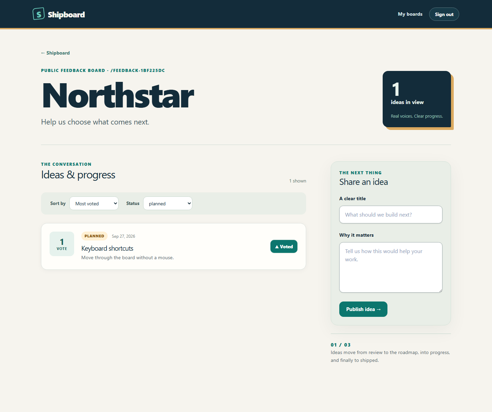

# Shipboard

Shipboard is a product-feedback board. Owners create public boards, review suggestions and move them through a visible roadmap. Visitors can read suggestions; signed-in people can submit and vote. The Next.js web app and Fastify API use PostgreSQL 18, explicit Drizzle migrations, and production container images.



Interface captures from disposable browser fixtures: [home](docs/screenshots/sprint-005-home.png), [mobile public board](docs/screenshots/sprint-005-public-mobile.png), [owner review](docs/screenshots/sprint-005-owner-review.png).

## Requirements

- Node.js 24.16.0 (`.node-version` documents the exact local version)
- pnpm 12.3.4
- Docker with Compose v2 for local PostgreSQL 18 and database integration tests
- OpenSSL CLI for the disposable HTTPS certificate in `pnpm test:e2e` (Git for Windows includes it; `OPENSSL_BIN` can select another executable)

## Local development

```bash
pnpm install --frozen-lockfile
docker compose up -d postgres
pnpm --filter @shipboard/api build
pnpm --filter @shipboard/api db:migrate
pnpm dev:web
pnpm dev:api
```

Before starting Compose, copy `.env.example` to an ignored root `.env`. Replace the example PostgreSQL password in `POSTGRES_PASSWORD`, `DATABASE_URL` and `COMPOSE_DATABASE_URL`; URL-encode reserved password characters in the URLs. Generate a unique `AUTH_SECRET` of at least 32 characters and replace its placeholder. The API validates it at startup and never logs it. Compose reads `POSTGRES_*`; native API and migration scripts load root `.env` with Node's environment-file option. Exported process variables take precedence. Production injects environment variables directly. The database host port is loopback-only; keep `POSTGRES_PORT` and the native URL aligned. `.env.example` explicitly uses 5432 and overrides the Compose default.

The default Compose profile still starts PostgreSQL only. A complete local stack is also available after setting `COMPOSE_DATABASE_URL` in `.env` to use the same database, user, and URL-encoded password as `POSTGRES_*`, with host `postgres` and port `5432`:

```bash
docker compose build api web
docker compose up -d --wait postgres
docker compose --profile full run --rm --no-deps api node dist/infrastructure/database/migrate.js
docker compose --profile full up --build -d --wait
docker compose --profile full exec web node scripts/probe-api.mjs
```

The migration command is explicit; normal API startup never migrates. For foreground logs, use `docker compose --profile full up`. Web, API, and PostgreSQL are published on loopback; `WEB_PORT`, `API_PORT`, and `POSTGRES_PORT` override host ports only. Internal ports remain 3000, 3001, and 5432. The API inside Compose gets `COMPOSE_DATABASE_URL`; native commands use `DATABASE_URL`. `API_INTERNAL_URL` is the web container's operational probe target (`http://api:3001`), while `API_PUBLIC_URL` is the browser-reachable API origin (`http://localhost:3001` by default). The latter is read at web runtime and is not baked into the image. Keep `WEB_ORIGIN` and `AUTH_BASE_URL` aligned with the browser's actual web/API origins when published ports change. Use `localhost` consistently in the browser for both applications; mixing `localhost` and `127.0.0.1` breaks the cookie journey. The public shell still renders when the API or database is down.

The local Compose stack sets `AUTH_ALLOW_INSECURE_LOCAL=true` for HTTP on loopback only. Native development can use the same value from `.env`. Production browser traffic needs same-site HTTPS web/API origins, secure HttpOnly session cookies, and explicit trusted origins. Default domains on unrelated hosts can block third-party cookies in some browsers; choose a shared site when deploying. Never copy the local cookie exception to an arbitrary public origin. Board creation accepts an optional UUID `Idempotency-Key`; suggestion creation requires one. Board edits and suggestion status changes require the current `ETag` in `If-Match`; the web app handles both.

GitHub sign-in is optional. Create a GitHub OAuth app with its authorization callback URL set to `${AUTH_BASE_URL}/api/auth/callback/github` and set both `GITHUB_CLIENT_ID` and `GITHUB_CLIENT_SECRET` in the API environment. Never put the secret in the web environment, image, or committed files. With both values absent, the button is hidden and email/password remains available; a partial pair fails configuration validation. The provider requests identity and email access, including private verified email. Existing accounts with the same email are not implicitly linked. A password account can explicitly link GitHub from Settings; Shipboard stores only its public handle for profile display and fetches repositories only when the owner chooses one for a board. Confirm the callback, first and repeat sign-in, explicit linking, logout, cancellation and account-collision behavior with a real OAuth app before treating GitHub login as production verified.

`docker compose stop` and `docker compose --profile full down` preserve development data. Avoid `down -v` unless you intentionally want to remove the volume. Changing `POSTGRES_*` values does not change credentials in an already initialized volume. Container processes run as non-root users, and both application images are built from the repository root with pinned Node.js and pnpm versions. Their runtime configuration is injected through environment variables; do not put local `.env` files into images.

`docker compose ps` reports database health. `docker compose stop postgres` preserves the named data volume; starting it again restores the same data. Changing credentials in `.env` does not reset a volume that was already initialized. Do not use `docker compose down -v` on development data you want to keep.

Open `http://localhost:3000` to register or sign in, choose a username in Settings, create a board, and edit its name, slug and description. Public boards use `http://localhost:3000/{username}/{slug}`; suggestion details are nested below that URL and a public profile is available at `/{username}`. `PUBLIC` boards appear on the profile, `UNLISTED` boards are readable only through their canonical URL, and `PRIVATE` boards are visible only to their owner and otherwise respond as not found. Sort by recency or votes, filter by status and load further pages. Sign in to submit and vote; `/boards/{id}/suggestions` lets the owner review and change status. API liveness is `http://localhost:3001/health/live`; readiness is `/health/ready`. Liveness remains 200 while the process runs; readiness returns 503 during a database outage and recovers without restarting the API. The API validates `NODE_ENV`, `HOST`, `PORT`, `LOG_LEVEL`, `WEB_ORIGIN`, `AUTH_SECRET`, `AUTH_BASE_URL`, `AUTH_ALLOW_INSECURE_LOCAL`, the optional GitHub pair, `OTEL_SERVICE_NAME` and optional `OTEL_EXPORTER_OTLP_ENDPOINT`. An OTLP endpoint, when used, is a base URL such as `http://localhost:4318`.

`db:migrate` runs committed migrations explicitly. Run it before starting the API after a new checkout or schema change; normal API startup never migrates. Current migrations add Better Auth records, boards, scoped board idempotency, suggestions, votes and scoped suggestion idempotency after the baseline. Generate future changes with `pnpm --filter @shipboard/api db:generate`, then review SQL and metadata. The API build copies migration files beside compiled JavaScript. Deployments run that compiled migration command as a separate step with `DATABASE_URL`; the migration command does not need an auth secret.

Use Ctrl+C to stop either process. The API handles SIGINT/SIGTERM by closing Fastify and OpenTelemetry within five seconds before exit.

## Validation and production builds

```bash
pnpm format:check
pnpm lint
pnpm typecheck
pnpm test:unit
pnpm build
pnpm test:integration
pnpm exec playwright install chromium
pnpm test:e2e
docker compose config --quiet
docker compose --profile full config --quiet
pnpm --filter @shipboard/web start
pnpm --filter @shipboard/api start
```

`start` runs compiled output only; web uses its standalone server and copied static assets. Run `pnpm build` before `pnpm test:e2e`. Integration and browser tests each provision isolated PostgreSQL 18 with Testcontainers, independently of development Compose. The E2E runner starts real production artifacts on isolated ports, with a fresh API process for each scenario file to isolate production rate-limit windows. Its disposable GitHub fixture serves only the external authorization/token/profile/email boundary; Better Auth still checks state and persists real users and sessions. The fixture fetch import is used only by this runner and is absent from normal startup and runtime images. Docker and a Playwright Chromium install are required.

Build and verify the production images separately:

```bash
docker build -f apps/api/Dockerfile -t shipboard-api:sprint-005 .
docker build -f apps/web/Dockerfile -t shipboard-web:sprint-005 .
pnpm test:containers --api
pnpm test:containers --web
pnpm test:containers
```

The container tests use unique disposable Docker networks and Compose projects, dynamic host ports and generated fixture credentials. They clean up their own resources and do not use the development database. The full-stack check covers auth/board creation and editing, health, web-to-API connectivity, explicit migrations, database outage/recovery, volume persistence, and API shutdown. CI builds both images and runs these checks and Playwright on Linux. The browser suite covers the public suggestion/vote/status journey; a live GitHub authorization is a separate manual gate.
